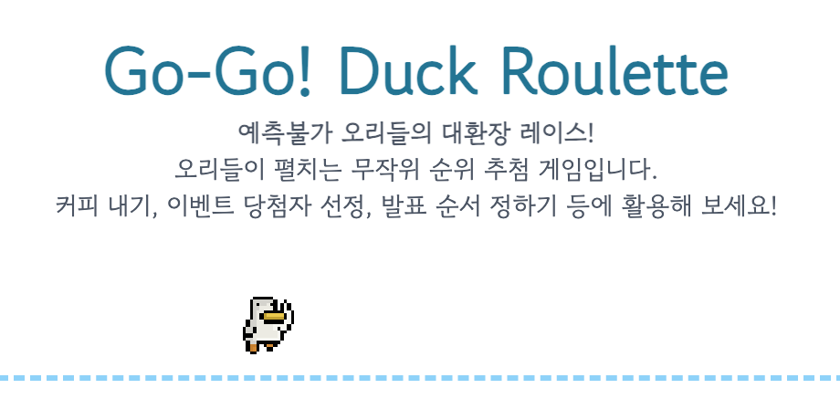

# 달려라! 오리 룰렛 (Go-Go! Duck Roulette)

[🇺🇸 English](README.en.md)



오리들이 펼치는 무작위 순위 추첨 게임입니다!

[게임 플레이하기](https://hyojun.me/gogoduck)

## 개발 및 빌드

이 프로젝트는 Webpack을 사용하여 빌드됩니다.

### 설치

```bash
npm install
```

### 개발 서버 실행

```bash
npm run dev
```
`http://localhost:9000`에서 확인 가능합니다.

### 프로덕션 빌드

```bash
npm run build
```
`dist` 폴더에 빌드 결과물이 생성됩니다.

### 프로덕션 빌드 미리보기

```bash
npm run preview
```
프로덕션 빌드를 로컬에서 실행하여 정상 작동하는지 확인합니다.

## 크레딧

- Duck assets: [Ulti (OpenGameArt.org)](https://opengameart.org/content/character-spritesheet-duck)
- BGM: [congusbongus (OpenGameArt.org)](https://opengameart.org/content/the-fridge-is-hungry)
- Win sound: [Listener (OpenGameArt.org)](https://opengameart.org/content/win-sound-effect)
- Clap sound: [qubodup (OpenGameArt.org)](https://opengameart.org/content/well-done)
- Gowun Dodum (고운돋움체) 폰트: [yangheeryu](https://github.com/yangheeryu/Gowun-Dodum)
- [참고] 90% 이상의 코드는 Gemini 3.0 Pro 및 Gemini 2.5 Pro로 작성되었습니다.

## 라이선스

이 프로젝트는 [CC BY-NC-SA 4.0](LICENSE) 라이선스 하에 배포됩니다.
